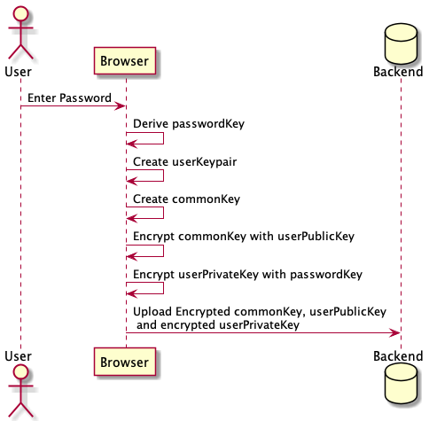
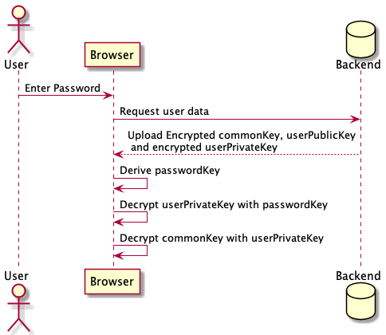
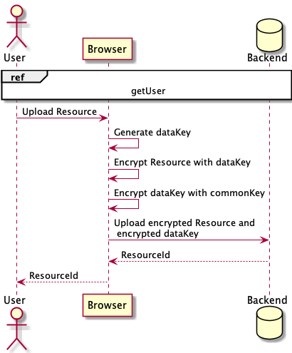
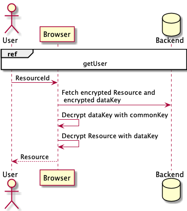
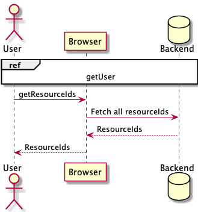

# E2EE FHIR Search Framework

The framework was developed to develop, test and benchmark algorithms that use a client-side search index to allow efficient search on end-to-end encrypted FHIR data.

## Testing and Benchmarking

To execute the tests run `npm run test`.
During the tests different metrics are measured.
The results can be found in `./out/log/`.

### Testresources

Resources and testcases can either be downloaded [here]{} or added individually.
The structure of the test data can be seen in `./src/resources/example/`.
By default the tests import the test data from `./src/resources/testcases/`.

#### Synthea

Resources can also be generated using [synthea](https://github.com/synthetichealth/synthea).
To generate the resources run:

```
git clone https://github.com/synthetichealth/synthea.git
cd synthea
./gradlewbuild check test
./run_synthea
    -s 1337
    -cs 1337
    -r 20200115
    -p 1
    --exporter.years_of_history=75
```

`-s`, `-cs` and `-r` need to be set so that synthea runs deterministically. `-p` defines the population size and `--exporter.years_of_history` defines the years of medical history generated.

The data can now be found in synthea's output folder. Copy those over to `./src/resources/${testcase_name}/${dataset_name}/bundles/`.
To prepare the synthea data for tests you can now use `node ./script/`

### Different FHIR Version

The Framework is developed to test on FHIR version R4.
To allow different versions you have to update the search parameter mapping.

Therefore you have to find the `search-parameters.json` and add it to `./assets/search-parameters.json`.
For R4 this file can be found at `ttps://www.hl7.org/fhir/r4/search-parameters`. Now run `node ./scripts/generate-parameter-mapping.js` to generate `./src/parameterMapping.json` that is consumed by the FHIR validation.

## Background

### Backend

To allow testing with minimal overhead IndexedDB was chosen to store the data. IndexedDB is a client-side storage supported by most modern browsers. In addition a wrapper written to imitate the server.

### Crypto Protocol

This chapter describes the basic crypto flows implemented in the framework. The flows are more complicated than needed for a single user usecase but implemented that way to mirror current EHR implementations.
The end-to-end encryption the following keys:

- passwordKey: Symmetric key that is derived from the user's password.
- user(Public/Private)Key: Asymmetric user specific keypair.
- commonKey: Symmetric user specific key.
- dataKey: Symmetric resource specific key.

#### Create User



#### Get User



#### Create Resource



#### Get Resource



#### Get Resource Ids


